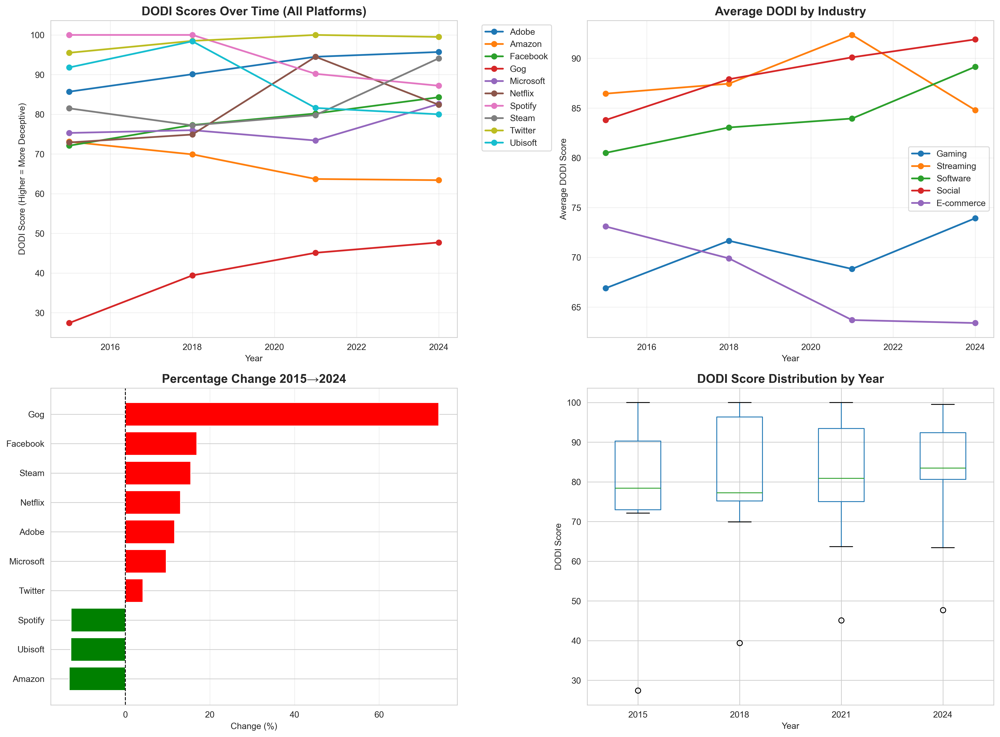
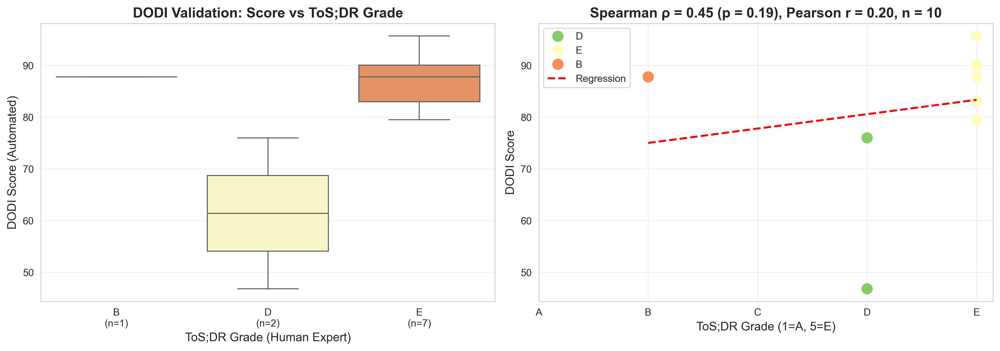

# DODI: Digital Ownership Deception Index

**When you click "Buy now" on a digital storefront, you almost never buy anything.** The fine print grants you a revocable licence. DODI measures how hard a platform's Terms of Service work to keep you from noticing, and tracks how that language has evolved over a decade.

Built solo for the Data and Society seminar at Saarland University, grounded in Perzanowski & Hoofnagle's 2017 finding that 83% of consumers misread "Buy now" as actual ownership.

**Score any ToS yourself at [dodi-web.onrender.com](https://dodi-web.onrender.com/)**, the deployed version of this scorer ([code](https://github.com/Axwolf13/dodi-web)).

## Key findings



**1. Ownership language got worse, not better.** Across 10 major platforms and four ToS snapshots each (2015, 2018, 2021, 2024, pulled from the Wayback Machine), the mean DODI score rose from 72.5 to 77.3. Seven of ten platforms drifted toward more licence-heavy, less readable, more aggressive terms.

**2. The index passes its face-validity test.** GOG, the DRM-free store whose whole brand is "you actually own your games", scores lowest of all ten platforms in every year (25.9 in 2015). Adobe (subscription-everything) and Twitter sit at the top, in the 86-100 range. The metric lands where domain knowledge says it should.

**3. Netflix 2024 is the poster child.** Its ToS uses ownership words twice and licence words 99 times, a licence-to-ownership ratio of 49.5, the highest in the corpus.

**4. Validation against human experts is promising but not conclusive.** DODI scores correlate with ToS;DR's expert-assigned grades at Spearman ρ = 0.54 (p = 0.07, n = 12); Pearson r = 0.39. Part of the gap is construct validity: ToS;DR rates general fairness, DODI rates ownership transparency specifically. Wikipedia illustrates the difference: it earns a good ToS;DR grade (B) for overall fairness but a mediocre DODI score, because its copyleft licensing (CC-BY-SA) fills the text with "license" terms that the ratio counts. "Fair" and "transparent about ownership" are different properties and DODI only measures the second.

> Data-integrity note: this Wikipedia document was originally mislabeled "WhatsApp" in the corpus (the ToS;DR service ID and grade were correct, the display name was not). The mistake was caught by an LLM-as-judge sanity pass, which read the text and flagged that it described community-contributed copyleft content, not a messaging app. See `scripts/llm_judge.py`.



## Cross-checking with an LLM judge (where it gets interesting)

I built a second, independent grader to check DODI: an LLM reads each document against a rubric and scores it 0-100 for ownership deception (`scripts/llm_judge.py`, `scripts/analyze_judge_agreement.py`). It runs on the local Claude subscription through the CLI, no API billing, and every response is cached so the analysis is reproducible.

I expected the judge to agree with DODI. It did not, and running a second, larger model only made the disagreement more robust.

Three graders on the same documents (DODI counts licence words, the LLMs read the text):

| Grader | vs DODI | vs ToS;DR humans (n=12) |
|---|---|---|
| DODI (deterministic) | — | ρ = 0.54 |
| Claude Sonnet (reads) | 0.10 | ρ = 0.46 |
| Claude Haiku (reads) | 0.11 (n=52) | ρ = 0.30 |
| Sonnet vs Haiku | 0.44 | |

What this actually says, in order of how much I trust it:

1. **The DODI disagreement is real and not a weak-model artifact.** A small model (Haiku) and a much larger one (Sonnet) both land at ρ ≈ 0.10 against DODI. They also rank documents differently from DODI in different ways: Haiku scores high and narrow (lots of 68s), Sonnet scores lower and wider (most mainstream ToS land at "moderate", grade C). Different distributions, same conclusion: neither reads the documents the way DODI counts them.
2. **The two readers agree with each other (0.44) more than either agrees with DODI (0.10).** There is an LLM consensus, and DODI is not in it.
3. **But DODI is not simply wrong.** It tracks the human ToS;DR experts *best* of the three (0.54, vs Sonnet 0.46, vs Haiku 0.30). The word-counter matches humans better than the readers do.
4. **Loud caveat:** every human comparison is n = 12 and none is statistically significant (p = 0.07 / 0.13 / 0.34). DODI vs Sonnet against humans is a near-tie. The only correlation on a bigger sample is Haiku-vs-DODI at n = 52.

The clearest single case is **Adobe 2024**: DODI's most-deceptive document (95.7), which both LLMs score far lower (Sonnet 20, Haiku 44). The readers point at the same thing: Adobe openly says "licensed, not sold", carries plain-language summaries and pro-consumer terms, and never dangles a "buy" button. DODI can't tell honest licensing from deceptive licensing, because it counts "licence" words. That is DODI's real construct-validity flaw, and the fix is the marketing-vs-contract gap (deception is highest where the store says "buy" and the contract says "licence"), which is the natural DODI v2.

The honest read: three reasonable methods for "ownership deception" barely converge. It is not one well-defined number, which is a caution against trusting any single automated ToS score, including this one. The judges run on the local Claude subscription via the CLI (`scripts/judge_sonnet_validation.py` for the Sonnet robustness check), so temperature is uncontrolled; a cross-vendor judge (Gemini) is the next check, pending free-tier quota.

## How the score works

```
DODI = 0.25 × readability penalty + 0.50 × licence ratio score + 0.25 × red-flag score
```

- **Licence ratio (50%):** count of licence terms ("license", "subscription", "access", "grant"...) over ownership terms ("buy", "own", "purchase"...). The core deception mechanism per Perzanowski & Hoofnagle, hence the dominant weight.
- **Readability (25%):** Flesch-Kincaid grade level via `textstat`. Grade 8 or below scores 0, grade 16+ scores 100. Complexity enables deception but isn't deception itself.
- **Red flags (25%):** counts of aggressive clauses across three families: unilateral termination ("sole discretion", "without notice"), rights waivers ("class action", "arbitration", "indemnify") and data exploitation ("third parties", "sell your", "track").

Scores run 0-100; higher = more deceptive about ownership. The scorer is fully deterministic: same document in, same score out, no API calls, no models, which is what makes the 2015-2024 longitudinal comparison clean.

## Repository structure

```
scripts/
  dodi_analyzer_clean.py      the scorer (this is the core of the project)
  analyze_temporal_data.py    runs DODI over data/temporal, writes output/temporal_results.csv
  run_validation_analysis.py  DODI vs ToS;DR grades, writes validation_results.csv + plot
  visualize_temporal_trends.py  builds the 4-panel figure above
  batch_analyzer_clean.py     score any folder of .txt ToS documents
  test_weights_face_validity.py  sanity checks on the 25/50/25 weighting
  download_tos_documents.py   fetch ToS snapshots from the Wayback Machine
  tosdr_working_api.py        pull grades from the ToS;DR API
data/
  temporal/                   40 ToS snapshots: 10 platforms × {2015, 2018, 2021, 2024}
  validation/                 12 current ToS texts matched to ToS;DR grades
output/                       results CSVs and figures
```

## Run it

```sh
pip install -r requirements.txt

# rescore the temporal corpus (10 platforms × 4 years)
python scripts/analyze_temporal_data.py

# reproduce the validation study against ToS;DR
python scripts/run_validation_analysis.py

# score your own documents: drop .txt files in a folder and point the batch analyzer at it
python scripts/batch_analyzer_clean.py
```

Run everything from the repo root; scripts resolve `data/` and `output/` relative to it.

## Use DODI from Claude (MCP server)

DODI is also an [MCP](https://modelcontextprotocol.io/) server, so Claude Code and Claude Desktop can score documents mid-conversation. Paste a ToS at Claude, ask "how deceptive is this?" and it calls the same deterministic scorer this repo ships.

```sh
claude mcp add dodi -- python mcp_server.py
```

Three tools: `score_tos` (the 0-100 index), `explain_score` (the evidence behind the number: which terms and red-flag clauses matched, how often) and `get_platform_rankings` (the 2015-2024 study results). Tested end to end in `tests/test_mcp_server.py`, no API key needed; the scorer runs locally.

## Honest limitations

- **Keyword counting has no sense of negation.** "You do not own this content" counts an ownership word. Manual spot checks suggest deceptive ToS rarely negate this way (they avoid ownership words entirely, which the ratio catches), but it's a real blind spot.
- **n = 12 for validation** is too small for significance; ρ = 0.54 at p = 0.07 is encouraging, not proof.
- **Wayback snapshots have coarse timing**, so a "2015" document is the nearest capture to that year, not January 1st.
- **The score is gameable.** A platform could pad its ToS with ownership words without changing its terms. DODI measures language, not legal substance.

## Future work

Negation-aware clause parsing (spaCy dependency trees), an LLM-as-judge validation layer on a larger sample to complement ToS;DR, clause-level embeddings to trace how specific licence clauses propagate between platforms' documents over time, and a marketing-vs-ToS gap metric (the deception is largest where the storefront says "buy" and the contract says "licence").

## References

- Perzanowski, A. & Hoofnagle, C. J. (2017). *What We Buy When We Buy Now*. University of Pennsylvania Law Review.
- [ToS;DR](https://tosdr.org/), Terms of Service; Didn't Read, the human-curated grades used for validation.

---

Akshay Ashok · [axwolf13.github.io](https://axwolf13.github.io/) · akshay57ax@gmail.com
